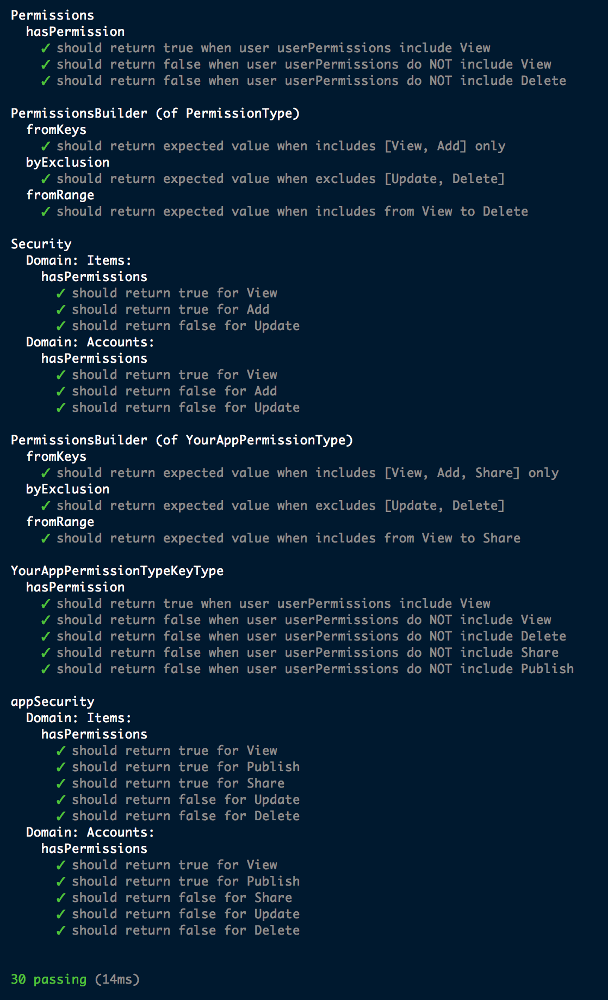

# sa-permissions

[](https://badge.fury.io/js/sa-permissions)

--- ATTENTION: this source code is No longer actively maintained ---

Utilities to add permissions check to your TypeScript/JavaScript app.

### examples
[in progress, see examples folder]

```
const params: HasPermissionsArgs = {
	id: id,
	domain: 'Items',
	permissionType: PermissionType.View,
}
const result = appSecurity.hasPermissions(params)
```

##### Unit tests results


#### Remarks
Dependabots vulnerabilities last fixed on 08/08/2021


    "build": "tsc --preserveSymlinks true; npm run rollup-browser",
